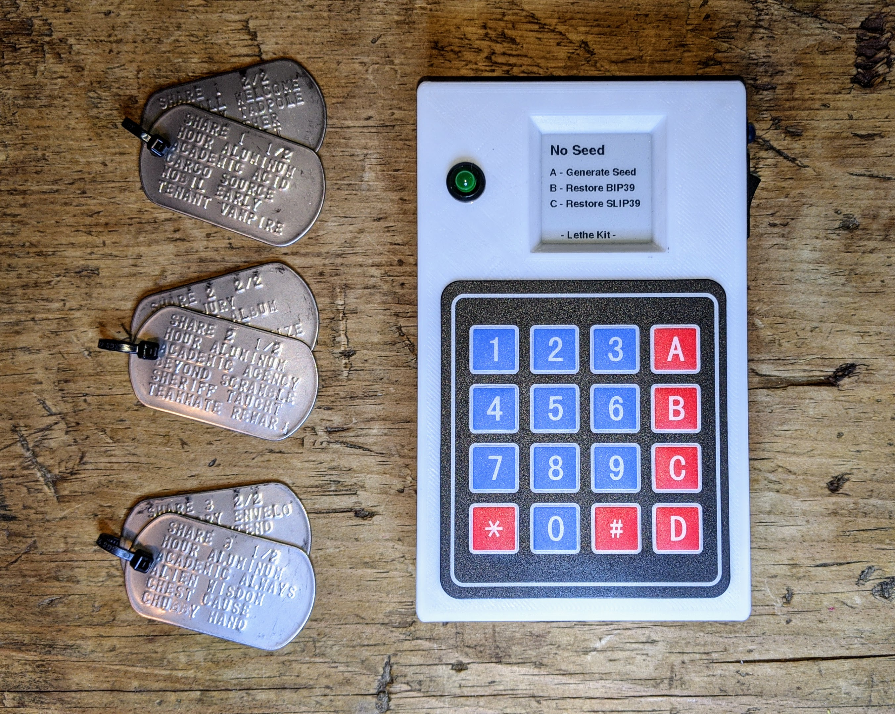

# Blockchain Commons LetheKit

**Open source DIY hardware box for offline cryptographic tools**

*LetheKit* is a do-it-youself platform for performing various sensitive cryptographic operations on an offline airgapped device. It uses no WiFi or Bluetooth which could leak information and contains no local storage, and when the device is turned off it forgets any sensitive data stored in RAM. Thus the name Lethe (_lee-thee_), from the [mythological river](https://en.wikipedia.org/wiki/Lethe) of forgetfulness and oblivion.

## Additional Information

The following files contain everything you need to set up your *LetheKit* hardware and install its software.

* The [Parts List](doc/parts-list.md) describes all needed parts.
* The [Case Information](case) contains STL files for 3-D printing.
* The [Lethekit Assembly Instructions](doc/assembly.md) show how to put it together.
* The [Lethekit Installation Instructions](doc/installation.md) show how to install LetheKit in your Arduino development environment.
* The [Seedtool Installation Instructions](seedtool/doc/build.md) show to install Seedtool on your *LetheKit* using the Arduino IDE.
* The [Seedtool Application Instuctions](seedtool/README.md) describe how to generate and recover
[BIP-32](https://github.com/bitcoin/bips/blob/master/bip-0032.mediawiki) HD wallet master seeds in [BIP-39](https://github.com/bitcoin/bips/blob/master/bip-0039.mediawiki) and [SLIP-39](https://github.com/satoshilabs/slips/blob/master/slip-0039.md) formats.

## Status - Late Alpha

*LetheKit* is currently under active development and in the late alpha testing phase. It should not be used for production tasks until it has had further testing and auditing.

### Known Issues

#### ⚠️ Warning: Lack of Round-trip Compatibility between BIP-39 and SLIP-39

At first glance, BIP-39 and SLIP-39 both appear to be means of converting a binary seed to a set of backup words and back. You might assume you could simply convert a BIP-39 backup to a binary seed, from that binary seed to SLIP-39, and then use the SLIP-39 backup to recover the same wallet as the original BIP-39 backup, but this is **NOT** the case. This is because the SLIP-39 algorithm that SatoshiLabs uses in their Trezor wallet does not derive the master secret in the same way as their BIP-39 algorithm does.

Currently Blockchain Commons is investigating an alternative to SLIP-39 that allows round-trips with BIP-39. We want to ensure that the same seed will result in the same derived keys using either BIP-39 or our alternative approach.

As SLIP-39 is not round-trip compatible with BIP-39, and SLIP-39 is under the control of SatoshiLabs and does not appear to be a fully community-controlled standard, Blockchain Commons is no longer endorsing SLIP-39.

* This issue is being tracked [here](https://github.com/BlockchainCommons/bc-lethekit/issues/38).

## Origin, Authors, Copyright & Licenses

Unless otherwise noted (either in this [/README.md](./README.md) or in the file's header comments) the contents of this repository are Copyright © 2020 by Blockchain Commons, LLC, and are [licensed](./LICENSE) under the [spdx:BSD-2-Clause Plus Patent License](https://spdx.org/licenses/BSD-2-Clause-Patent.html).

In most cases, the authors, copyright, and license for each file reside in header comments in the source code. The table below attempts to attribute accurately for files without such information.

This table below also establishes provenance (repository of origin, permalink, and commit id) for files included from repositories that are outside of this one. Contributors to these files are listed in the commit history for each repository, first with changes found in the commit history of this repo, then in changes in the commit history of their repo of their origin.

| File      | From                                                         | Commit                                                       | Authors & Copyright (c)                                | License                                                     |
| --------- | ------------------------------------------------------------ | ------------------------------------------------------------ | ------------------------------------------------------ | ----------------------------------------------------------- |
| Cryptosuite | [https://github.com/ksedgwic/Cryptosuite](https://github.com/ksedgwic/Cryptosuite) | ae0e3eeb4eb00c53fe235e0c34f77ade11f1982a | 2010 Peter Knight | <none> |
| bip39 | [https://github.com/ksedgwic/bip39](https://github.com/ksedgwic/bip39) | 9b8fa3c7d145c39558c2534f6cf40879477d93a1 | 2018 Chris Howe | [MIT License](https://github.com/ksedgwic/bip39/blob/master/LICENSE) |
| TRNG-for-ATSAMD51J19A-Adafruit-Metro-M4- | [https://github.com/SapientHetero/TRNG-for-ATSAMD51J19A-Adafruit-Metro-M4-](https://github.com/SapientHetero/TRNG-for-ATSAMD51J19A-Adafruit-Metro-M4-) | 17d5e36cd922ce7df8047d9c89633dca9b5ae122 | 2019 Ron Sutton | [MIT License](https://github.com/SapientHetero/TRNG-for-ATSAMD51J19A-Adafruit-Metro-M4-/blob/master/LICENSE.txt) |

### Dependencies

To build the *LetheKit* you'll need to use the following exterinal tools:

- [The Arduino IDE](https://www.arduino.cc/en/main/software)

The following internal Blockchain Commons projects are leveraged by *LetheKit*:

- [BlockchainCommons/bc-crypto-base](https://github.com/blockchaincommons/bc-crypto-base) — Well-Reviewed and Audited Cryptographic Functions for Use in Blockchain Commons Software Projects
- [BlockchainCommons/bc-shamir](https://github.com/BlockchainCommons/bc-shamir) - C Implementation of Shamir Secret Sharing for use in Blockchain Commons Software Projects
- [BlockchainCommons/bc-slip39](https://github.com/BlockchainCommons/bc-slip39) - C Implementation of SLIP-39 Shamir Secret Sharing standard.

### Derived from ...

The *LetheKit* project was inspired by:

- [Bitcoin 2019 Conference Tutorial](https://github.com/arcbtc/bitcoin2019conf), by [Ben Arc](https://github.com/arcbtc), which provided a fully functional starting point using similar hardware.

### Used with ...

These are other projects that work with or leverage *LetheKit*.

- (submit a PR to this repo list your project)

## Financial Support

*LetheKit* (lee-thee kit) is a project of [Blockchain Commons](https://www.blockchaincommons.com/). We are proudly a "not-for-profit" social benefit corporation committed to open source & open development. Our work is funded entirely by donations and collaborative partnerships with people like you. Every contribution will be spent on building open tools, technologies, and techniques that sustain and advance blockchain and internet security infrastructure and promote an open web.

To financially support further development of *LetheKit* and other projects, please consider becoming a Patron of Blockchain Commons through ongoing monthly patronage as a [GitHub Sponsor](https://github.com/sponsors/BlockchainCommons). You can also support Blockchain Commons with bitcoins at our [BTCPay Server](https://btcpay.blockchaincommons.com/).

## Contributing

We encourage public contributions to this project through issues and pull requests! Please review [CONTRIBUTING.md](./CONTRIBUTING.md) for details on our development process. All contributions to this repository require a GPG signed [Contributor License Agreement](./CLA.md).

### Questions & Support

As an open-source, open-development community, Blockchain Commons does not have the resources to provide direct support of our projects. If you have questions or problems, please use this repository's [issues](./issues) feature. Unfortunately, we can not make any promises on response time.

If your company requires support to use our projects, please feel free to contact us directly about options. We may be able to offer you a contract for support from one of our contributors, or we might be able to point you to another entity who can offer the contractual support that you need.

### Credits

The following people directly contributed to this repository. You can add your name here by getting involved; the first step is to learn how to contribute from our [CONTRIBUTING.md](./CONTRIBUTING.md) documentation.

| Name              | Role                | Github                                            | Email                                 | GPG Fingerprint                                    |
| ----------------- | ------------------- | ------------------------------------------------- | ------------------------------------- | -------------------------------------------------- |
| Christopher Allen | Principal Architect | [@ChristopherA](https://github.com/ChristopherA) | \<ChristopherA@LifeWithAlacrity.com\> | FDFE 14A5 4ECB 30FC 5D22  74EF F8D3 6C91 3574 05ED |
| Ken Sedgwick      | Project Lead        | [@ksedgwic](https://github.com/ksedgwic)          | \<ken@bonsai.com\>                  | 4695 E5B8 F781 BF85 4326 9639 BBFC E515 8602 5550  |

## Responsible Disclosure

We want to keep all our software safe for everyone. If you have discovered a security vulnerability, we appreciate your help in disclosing it to us in a responsible manner. We are unfortunately not able to offer bug bounties at this time.

We do ask that you offer us good faith and use best efforts not to leak information or harm any user, their data, or our developer community. Please give us a reasonable amount of time to fix the issue before you publish it. Do not defraud our users or us in the process of discovery. We promise not to bring legal action against researchers who point out a problem provided they do their best to follow the these guidelines.

### Reporting a Vulnerability

Please report suspected security vulnerabilities in private via email to ChristopherA@LifeWithAlacrity.com (do not use this email for support). Please do NOT create publicly viewable issues for suspected security vulnerabilities.

The following keys may be used to communicate sensitive information to developers:

| Name              | Fingerprint                                        |
| ----------------- | -------------------------------------------------- |
| Christopher Allen | FDFE 14A5 4ECB 30FC 5D22  74EF F8D3 6C91 3574 05ED |

You can import a key by running the following command with that individual’s fingerprint: `gpg --recv-keys "<fingerprint>"` Ensure that you put quotes around fingerprints that contain spaces.
