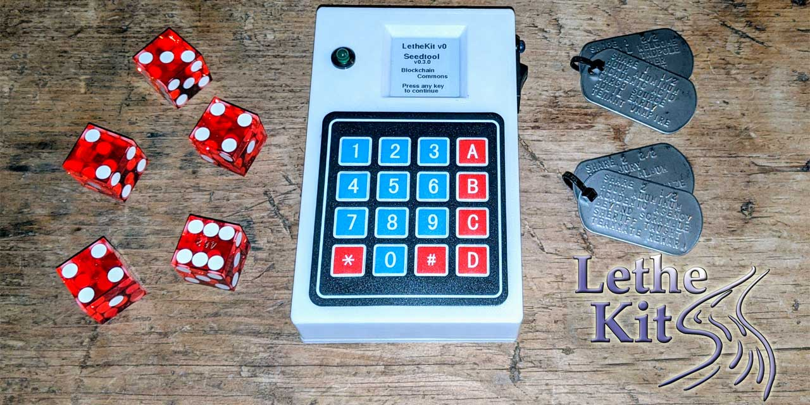

# Blockchain Commons LetheKit

**Open source DIY hardware box for offline cryptographic tools**

### _by [Ken Sedgwick](https://www.github.com/ksedgwic), [Gorazd Kovacic](https://www.github.com/gorazdko), and [Christopher Allen](https://www.github.com/ChristopherA)_

* &nbsp;&nbsp; ***part of the [crypto commons](https://github.com/BlockchainCommons/crypto-commons/blob/master/README.md) technology family***
*  ***part of the [gordian](https://github.com/BlockchainCommons/gordian/blob/master/README.md) technology family***

*LetheKit* is a do-it-youself platform for performing various sensitive cryptographic operations on an offline airgapped device. It uses no WiFi or Bluetooth which could leak information and contains no local storage, and when the device is turned off it forgets any sensitive data stored in RAM. Thus the name Lethe (_lee-thee_), from the [mythological river](https://en.wikipedia.org/wiki/Lethe) of forgetfulness and oblivion.

## Additional Information

The following files contain everything you need to set up your *LetheKit* hardware and install its software.

* The [Parts List](doc/parts-list.md) describes all needed parts.
* The [Case Information](case) contains STL files for 3-D printing.
* The [Lethekit Assembly Instructions](doc/assembly.md) show how to put it together.
* The [Lethekit Installation Instructions](doc/installation.md) show how to install LetheKit in your Arduino development environment.
* The [Seedtool Installation Instructions](seedtool/doc/build.md) show to install Seedtool on your *LetheKit* using the Arduino IDE.
* The [Seedtool Application Instuctions](seedtool/README.md) describe how to generate and recover
[BIP-32](https://github.com/bitcoin/bips/blob/master/bip-0032.mediawiki) HD wallet master seeds in [BIP-39](https://github.com/bitcoin/bips/blob/master/bip-0039.mediawiki) and [SSKR](https://github.com/BlockchainCommons/Research/blob/master/papers/bcr-2020-011-sskr.md) formats.
* [Blog Post Overview](https://www.blockchaincommons.com/projects/Releasing-LetheKit/)

Your LetheKit can be charged or recharged with a micro-USB connection.

## Gordian Principles

**Gordian LetheKit** is a hardware exemplar meant to display the [Gordian Principles](https://github.com/BlockchainCommons/Gordian#gordian-principles), which are philosophical and technical underpinnings to Blockchain Commons' Gordian technology. This includes:

* **Independence.** LetheKit ensures that you're in total control of your seeds.
* **Privacy.** LetheKit is totally offline.
* **Resilience.** LetheKit depends on you for its resilience, since you must back up your words or codes.
* **Openness.** LetheKit communicates through airgaps via URs and QRs, for maximum interoperability.

Blockchain Commons apps do not phone home and do not run ads. Some are available through various app stores; all are available in our code repositories for your usage.

## Status - Unsupported

*LetheKit* is no longer being actively supported by Blockchain Commons. It may not be up to date with recent security notices, and it may not work as originally intended or even at all. This repo remains solely for historical purposes. Use at your own risk. 

If you'd like to become a new lead for the project, please file an issue.

## Origin, Authors, Copyright & Licenses

Unless otherwise noted (either in this [/README.md](./README.md) or in the file's header comments) the contents of this repository are Copyright © 2020 by Blockchain Commons, LLC, and are [licensed](./LICENSE) under the [spdx:BSD-2-Clause Plus Patent License](https://spdx.org/licenses/BSD-2-Clause-Patent.html).

In most cases, the authors, copyright, and license for each file reside in header comments in the source code. The table below attempts to attribute accurately for files without such information.

This table below also establishes provenance (repository of origin, permalink, and commit id) for files included from repositories that are outside of this one. Contributors to these files are listed in the commit history for each repository, first with changes found in the commit history of this repo, then in changes in the commit history of their repo of their origin.

| File      | From                                                         | Commit                                                       | Authors & Copyright (c)                                | License                                                     |
| --------- | ------------------------------------------------------------ | ------------------------------------------------------------ | ------------------------------------------------------ | ----------------------------------------------------------- |
| Cryptosuite | [https://github.com/ksedgwic/Cryptosuite](https://github.com/ksedgwic/Cryptosuite) | ae0e3eeb4eb00c53fe235e0c34f77ade11f1982a | 2010 Peter Knight | <none> |
| bip39 | [https://github.com/ksedgwic/bip39](https://github.com/ksedgwic/bip39) | 9b8fa3c7d145c39558c2534f6cf40879477d93a1 | 2018 Chris Howe | [MIT License](https://github.com/ksedgwic/bip39/blob/master/LICENSE) |
| TRNG-for-ATSAMD51J19A-Adafruit-Metro-M4- | [https://github.com/SapientHetero/TRNG-for-ATSAMD51J19A-Adafruit-Metro-M4-](https://github.com/SapientHetero/TRNG-for-ATSAMD51J19A-Adafruit-Metro-M4-) | 17d5e36cd922ce7df8047d9c89633dca9b5ae122 | 2019 Ron Sutton | [MIT License](https://github.com/SapientHetero/TRNG-for-ATSAMD51J19A-Adafruit-Metro-M4-/blob/master/LICENSE.txt) |
| libwally-core | [https://github.com/ElementsProject/libwally-core](https://github.com/ElementsProject/libwally-core) | e0d0634aea716d813744326ea6c7590eb9fc381c | Jon Griffiths (Blockstream) 2016 | [BSD/MIT license](https://github.com/ElementsProject/libwally-core/blob/master/LICENSE) |
| Library-arduino-cbor | [https://github.com/jjtara/Library-Arduino-Cbor](https://github.com/jjtara/Library-Arduino-Cbor) | 996bf4a853513ee1fb94286691209a067c915bfb | jjtara 2014 | [Apache license](https://github.com/jjtara/Library-Arduino-Cbor/blob/master/LICENSE) |
| ArduinoSTL | [https://github.com/mike-matera/ArduinoSTL](https://github.com/mike-matera/ArduinoSTL) | 7411816e2d8f49d96559dbaa47e327816dde860c | Mike Matera 1999 | [GNU LGPL](https://github.com/mike-matera/ArduinoSTL/blob/master/LICENSE) |

### Dependencies

To build the *LetheKit* you'll need to use the following exterinal tools:

- [The Arduino IDE](https://www.arduino.cc/en/main/software)

The following internal Blockchain Commons projects are leveraged by *LetheKit*:

- [BlockchainCommons/bc-crypto-base](https://github.com/blockchaincommons/bc-crypto-base) — Well-Reviewed and Audited Cryptographic Functions for Use in Blockchain Commons Software Projects
- [BlockchainCommons/bc-shamir](https://github.com/BlockchainCommons/bc-shamir) - C Implementation of Shamir Secret Sharing for use in Blockchain Commons Software Projects
- [BlockchainCommons/bc-bytewords](https://github.com/BlockchainCommons/bc-bytewords) - C library for encoding and decoding Bytewords.
- [BlockchainCommons/bc-sskr](https://github.com/BlockchainCommons/bc-sskr) - Implementation of Sharded Secret Key Reconstruction (SSKR)

### Derived from ...

The *LetheKit* project was inspired by:

- [Bitcoin 2019 Conference Tutorial](https://github.com/arcbtc/bitcoin2019conf), by [Ben Arc](https://github.com/arcbtc), which provided a fully functional starting point using similar hardware.

### Used with ...

These are other projects that work with or leverage *LetheKit*.

- (submit a PR to this repo list your project)

## Financial Support

*LetheKit* (lee-thee kit) is a project of [Blockchain Commons](https://www.blockchaincommons.com/). We are proudly a "not-for-profit" social benefit corporation committed to open source & open development. Our work is funded entirely by donations and collaborative partnerships with people like you. Every contribution will be spent on building open tools, technologies, and techniques that sustain and advance blockchain and internet security infrastructure and promote an open web.

To financially support further development of *LetheKit* and other projects, please consider becoming a Patron of Blockchain Commons through ongoing monthly patronage as a [GitHub Sponsor](https://github.com/sponsors/BlockchainCommons). You can also support Blockchain Commons with bitcoins at our [BTCPay Server](https://btcpay.blockchaincommons.com/).

### Project Sponsors

Thanks to our project sponsors for their support of *LetheKit*:
  

[**Keystone**](https://keyst.one/) is the manufacturer of the Keystone Hardware Wallet and the Keystone Tablets. Their focus is on uncompromising security and ease of use, taking human error into consideration, skyrocketing attack costs, reducing burdens of proof, and avoiding single points of failure.
  
## Contributing

We encourage public contributions to this project through issues and pull requests! Please review [CONTRIBUTING.md](./CONTRIBUTING.md) for details on our development process. All contributions to this repository require a GPG signed [Contributor License Agreement](./CLA.md).

### Discussions

The best place to talk about Blockchain Commons and its projects is in our GitHub Discussions areas.

[**Gordian User Community**](https://github.com/BlockchainCommons/Gordian/discussions). For users of the Gordian reference apps, including [Gordian Coordinator](https://github.com/BlockchainCommons/iOS-GordianCoordinator), [Gordian Seed Tool](https://github.com/BlockchainCommons/GordianSeedTool-iOS), [Gordian Server](https://github.com/BlockchainCommons/GordianServer-macOS), [Gordian Wallet](https://github.com/BlockchainCommons/GordianWallet-iOS), and [SpotBit](https://github.com/BlockchainCommons/spotbit) as well as our whole series of [CLI apps](https://github.com/BlockchainCommons/Gordian/blob/master/Docs/Overview-Apps.md#cli-apps). This is a place to talk about bug reports and feature requests as well as to explore how our reference apps embody the [Gordian Principles](https://github.com/BlockchainCommons/Gordian#gordian-principles).

[**Blockchain Commons Discussions**](https://github.com/BlockchainCommons/Community/discussions). For developers, interns, and patrons of Blockchain Commons, please use the discussions area of the [Community repo](https://github.com/BlockchainCommons/Community) to talk about general Blockchain Commons issues, the intern program, or topics other than those covered by the [Gordian Developer Community](https://github.com/BlockchainCommons/Gordian-Developer-Community/discussions) or the 
[Gordian User Community](https://github.com/BlockchainCommons/Gordian/discussions).

### Other Questions & Problems

As an open-source, open-development community, Blockchain Commons does not have the resources to provide direct support of our projects. Please consider the discussions area as a locale where you might get answers to questions. Alternatively, please use this repository's [issues](./issues) feature. Unfortunately, we can not make any promises on response time.

If your company requires support to use our projects, please feel free to contact us directly about options. We may be able to offer you a contract for support from one of our contributors, or we might be able to point you to another entity who can offer the contractual support that you need.

### Credits

The following people directly contributed to this repository. You can add your name here by getting involved; the first step is to learn how to contribute from our [CONTRIBUTING.md](./CONTRIBUTING.md) documentation.

| Name              | Role                | Github                                            | Email                                 | GPG Fingerprint                                    |
| ----------------- | ------------------- | ------------------------------------------------- | ------------------------------------- | -------------------------------------------------- |
| Christopher Allen | Principal Architect | [@ChristopherA](https://github.com/ChristopherA) | \<ChristopherA@LifeWithAlacrity.com\> | FDFE 14A5 4ECB 30FC 5D22  74EF F8D3 6C91 3574 05ED |
| Ken Sedgwick      | Original Author, Occasional Contributor  | [@ksedgwic](https://github.com/ksedgwic)          | \<ken@bonsai.com\>                  | 4695 E5B8 F781 BF85 4326 9639 BBFC E515 8602 5550  |
| Gorazd Kovacic     | developer  | [@gorazdko](https://github.com/gorazdko)  | \<gorazdko@gmail.com\>  | 41F0 EA16 99A7 4C1E 2FA4 1B53 8CF9 6BC3 FF9D BBCE  |

## Responsible Disclosure

We want to keep all our software safe for everyone. If you have discovered a security vulnerability, we appreciate your help in disclosing it to us in a responsible manner. We are unfortunately not able to offer bug bounties at this time.

We do ask that you offer us good faith and use best efforts not to leak information or harm any user, their data, or our developer community. Please give us a reasonable amount of time to fix the issue before you publish it. Do not defraud our users or us in the process of discovery. We promise not to bring legal action against researchers who point out a problem provided they do their best to follow the these guidelines.

### Reporting a Vulnerability

Please report suspected security vulnerabilities in private via email to ChristopherA@LifeWithAlacrity.com (do not use this email for support). Please do NOT create publicly viewable issues for suspected security vulnerabilities.

The following keys may be used to communicate sensitive information to developers:

| Name              | Fingerprint                                        |
| ----------------- | -------------------------------------------------- |
| Christopher Allen | FDFE 14A5 4ECB 30FC 5D22  74EF F8D3 6C91 3574 05ED |

You can import a key by running the following command with that individual’s fingerprint: `gpg --recv-keys "<fingerprint>"` Ensure that you put quotes around fingerprints that contain spaces.
