#### Switch Harness

1. Separate (pull apart) a black/white pair from the jumper wires.
   Cut this pair in the middle and strip 1cm of the ends on one of the
   halves.

2. Separate a brown wire from the jumper wires. Cut this wire in the
   middle and strip 1cm of the ends on both halves.
   
3. Twist the stripped black lead together with the stripped brown
   leads and solder to post "1b" on the switch (under the "1" part of
   the switch).

4. Solder the white lead to the center post of the switch.

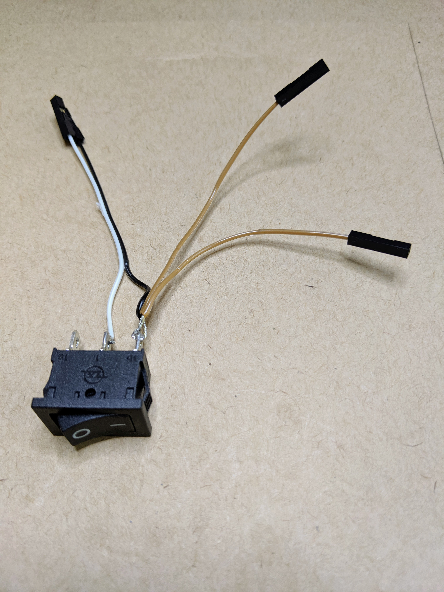

#### Display Harness

1. The Waveshare display comes with a cable with a display connector
   on one end and individual jumper connectors on the other.  Attach
   the display connector end to the display.
   
2. It's helpful to add a small cable tie (or similar) to the middle of
   the cable cluster to help keep the wires together.
   

#### SAMD51 Headers

1. Break the right-angle header stock into a 12 pin piece and a 16 pin
   piece.
   
2. Solder the headers onto the top of the SAMD51 module with the pins
   facing away from the board.
   
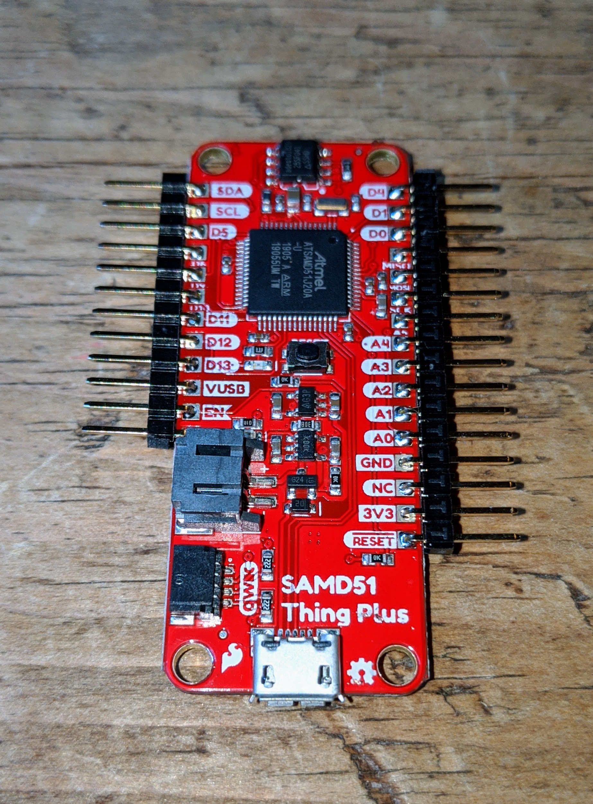

#### SAMD51 Jumper

We need an extra ground pin on the SAMD51 header.  Luckily there is
an unused (not-connected) pin we can commandeer.

1. Solder a piece of wire bridging the GND and NC pins on the bottom
   of the SAMD51.

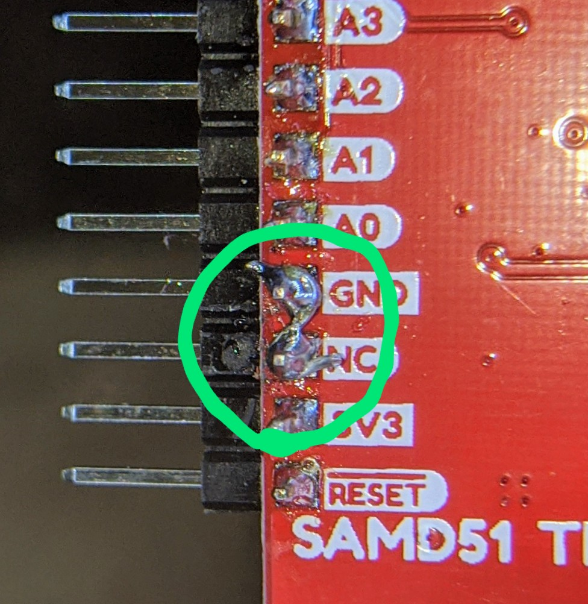

#### Attach Display Harness to SAMD51

1. Attach the Waveshare display harness to the SAMD51 module as shown
   in the picture.

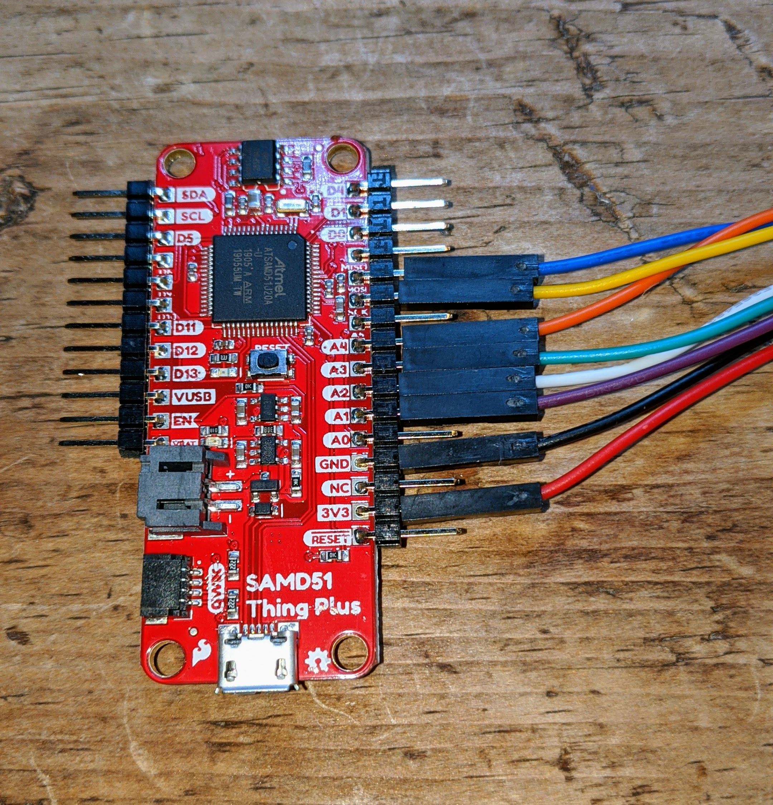

#### Led Wires

1. Separate a blue and green pair from the jumper wires.  Split the
   pair most of the way to one side.
   
2.  Attach the non-split side of the pair to the SAMD51 module as
    shown.

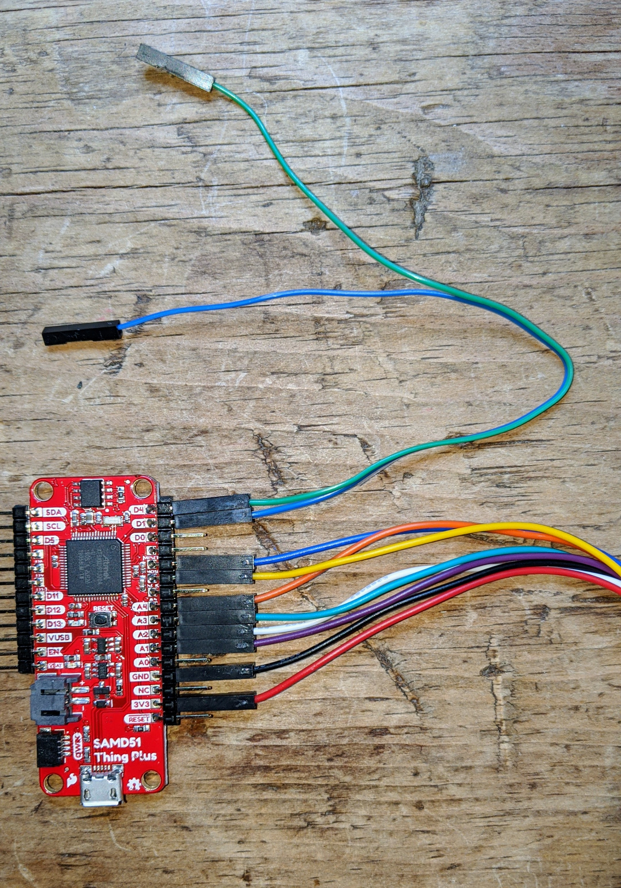
    
    
#### Keypad

1. Insert the keypad connector through the slot at the bottom of the
   case front.
   
2. Peel the adhesive cover off the back of the keypad and press it
   into place on the case as shown.
   

#### Attach Display to Case

1. Gently screw the display in place in the case.  DO NOT OVERTIGHTEN
   SCREWS. There are two sets of display holes to support an alternate
   display, use the set which align the display in it's cutout when
   viewed from the other side of the case.
   
2. It's helpful to dress the display wires towards the bottom of the
   case as they leave the display connector; we'll need to clear an
   LED inserted through the hole.
   
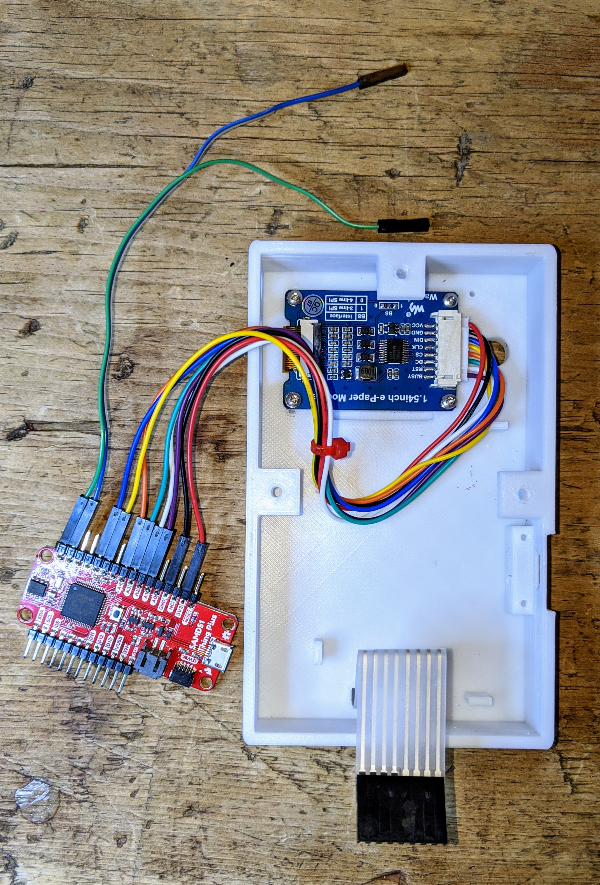
   

#### Attach LEDs to Case

1. Trim the LED leds a little. Trim the longer lead to 18mm length
   from the base of the LED and the shorter lead to 16mm.  The lead
   length is used to identify polarity so it's critical to keep the
   longer lead longer than the shorter lead.

2. Insert the blue led into a led holder and snap into place in the
   hole in the side of the case (above where the power switch will go.
   It's helpful if the led's leads are horizontally oriented.
   
3. Insert the green led into a led holder and snap into place in the
   hole in the front of the case.  Bend the leads in a 90 degree angle
   down towards the bottom of the case. Again it's helpful if the
   leads are oriented horizontally.
   
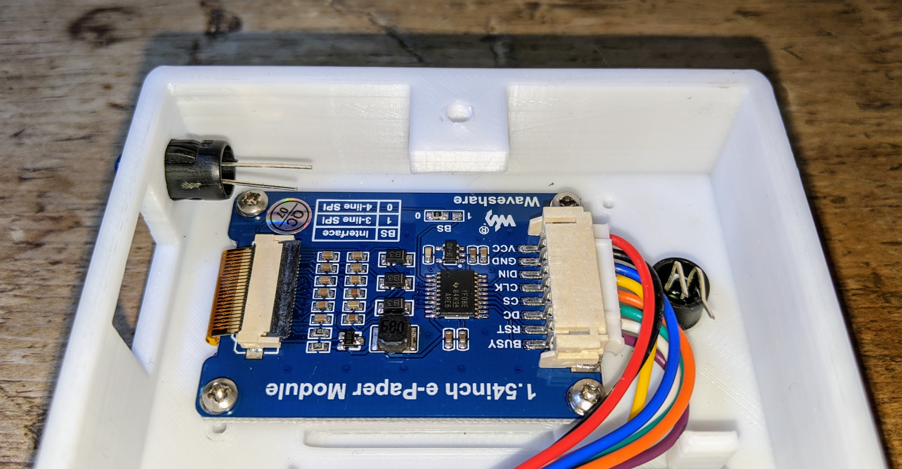

#### Attach the Switch to Case

1. Snap the switch into place in the case.  Orient the switch so the
   "1" side is towards the top of the case.
   
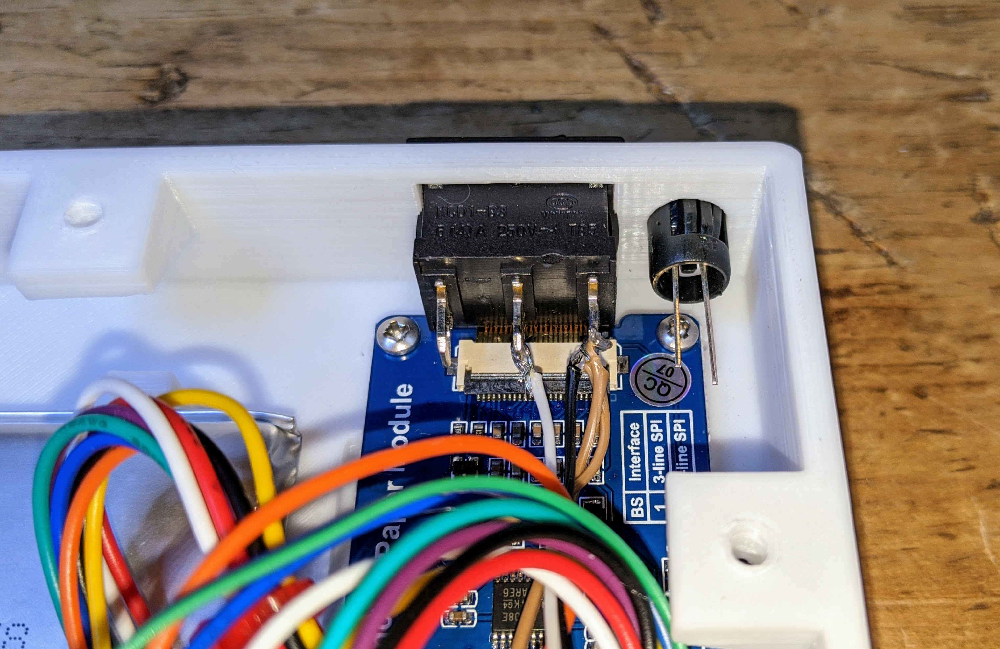

2. Connect the white and black switch leads to the SAMD51 module as
   shown.
   
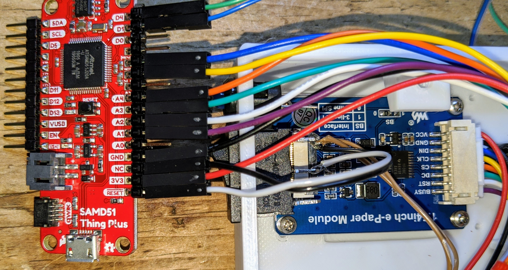

#### Insert Battery

1. Place the battery into the guides as shown.

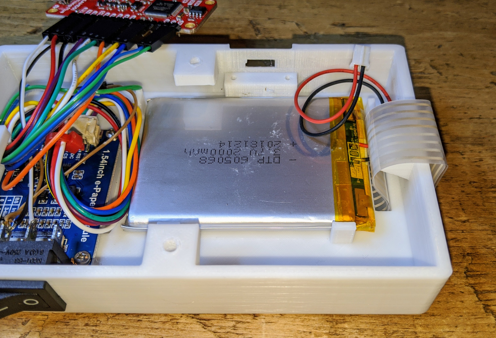

#### Battery Shield

1. Place the shield on top of the battery in the guides as shown.

The shield prevents the SAMD51 module from damaging the surface of the
battery.

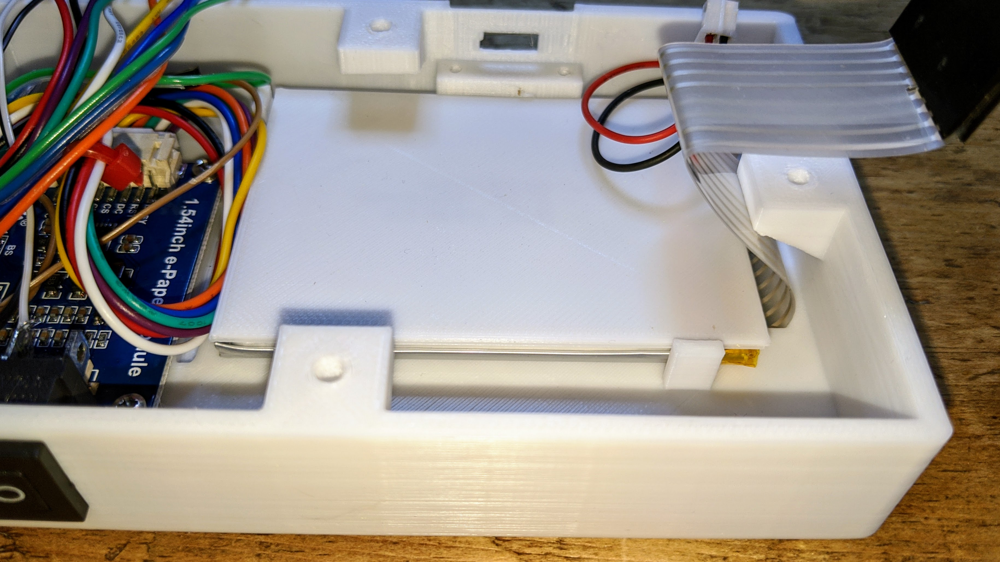

#### Keypad Connector

1. Connect the keypad connector to the SAMD51 as shown. Note that the
   connector fits "one pin in" from the end of the header.

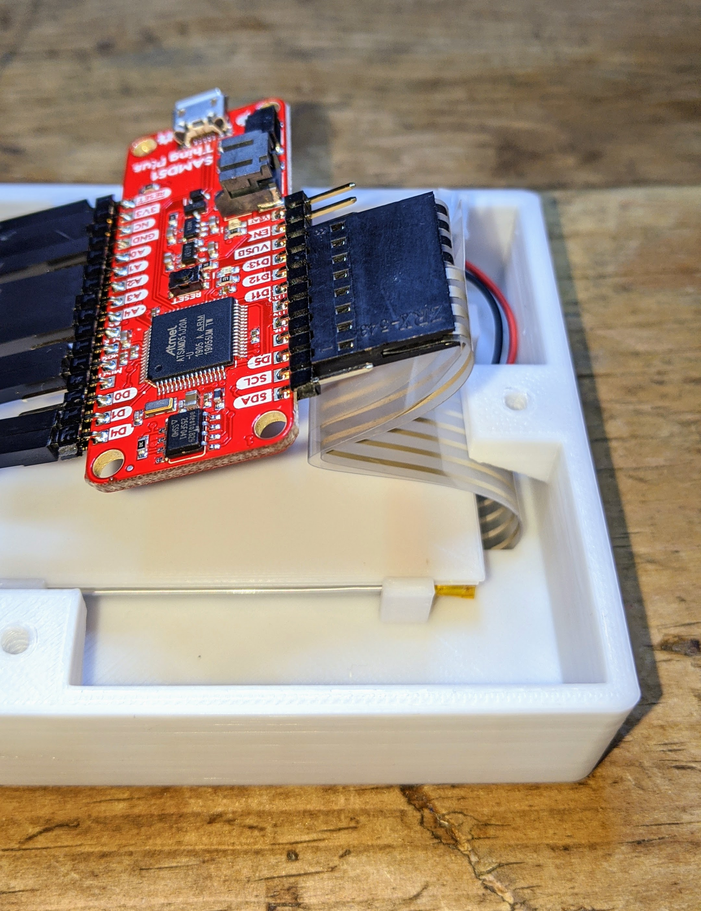

#### Attach SAMD51 to Case

1. Fit the SAMD51 into is mounting location.  Attach with screws.  DO
   NOT OVERTIGHTEN THE SCREWS.

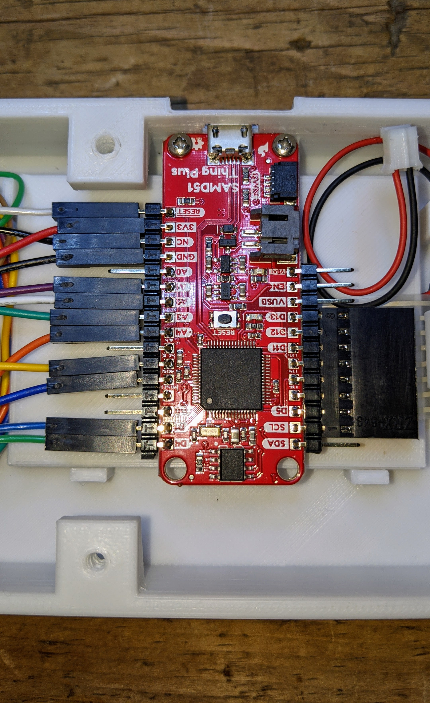

#### Connect LEDS

1. Connect the green wire to the longer lead of the green led.

2. Connect the blue wire to the longer lead of the blue led.

3. Connect one of the brown wires to the shorter lead of the green led.

4. Connect the other brown wires to the shorter lead of the blue led.

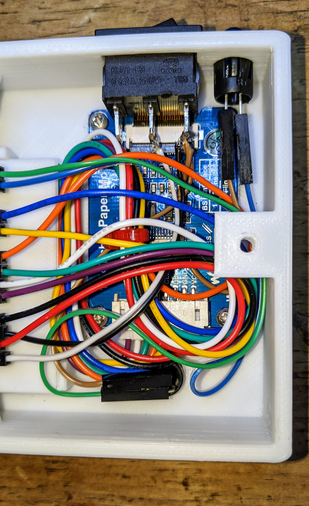

#### Connect Battery

1. Carefully connect the battery to the SAMD51.  Support the SAMD51 as
   you insert the connector to avoid stressing the attachment screws.
   
**IMPORTANT** - Always disconnect the battery first when working on
the inside of the terminal to avoid damaging the cicuits.

#### That's It!

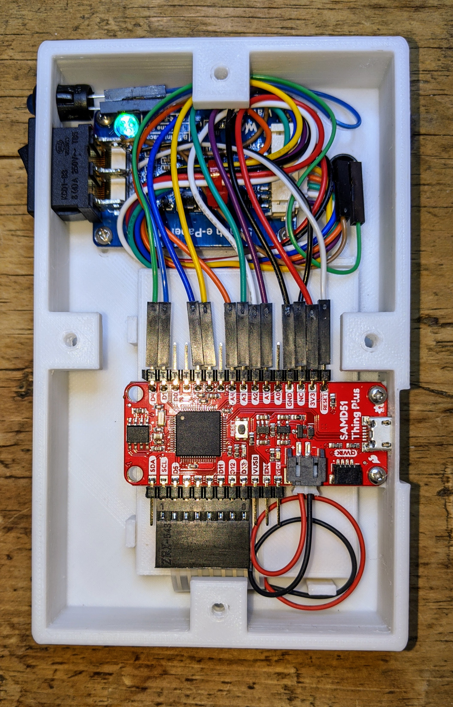

#### Attach the Cover

1. Press the rubber feet into the back cover.

2. Attach the cover to the back with the screws.
