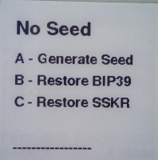
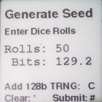
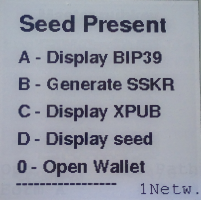

# The Seedtool BIP39/SLIP39 Utility

The *seedtool* utility allows you to generate and recover
[BIP-32](https://github.com/bitcoin/bips/blob/master/bip-0032.mediawiki)
HD wallet master seeds using
[BIP-39](https://github.com/bitcoin/bips/blob/master/bip-0039.mediawiki)
and
[SLIP-39](https://github.com/satoshilabs/slips/blob/master/slip-0039.md)
formats.

## Compile and Upload Instruction

Please see the [Instructions](doc/build.md)

## "No Seed" Functions

There are three ways to insert a key into the *seedtool*:

### Key Generation with Dice

By rolling dice and typing the values enough auditable entropy can be
gathered to generate a secure master seed.  Rolling 50 dice gathers
roughly 128 bits of entropy.

### BIP-39 Key Recovery

You can insert a key into the *seedtool* by entering it's BIP-39
recovery mnemonic passphrase.  From there you can generate SLIP-39
shares.

### SLIP-39 Key Recovery

If you possess enough shares of a SLIP-39 set, you can recover the
master seed with *seedtool*.  From there you can generate the BIP-39
mnemonic passphrase which will allow you to use it with most wallets.

 

## Functions with a Seed

Once you have a seed through any of the prior flows you can create
BIP-39 and SLIP-39 mnemonic passphrases.

### BIP-39 Generation

The BIP-39 phrase is displayed and can be backed up in a secure
offline fashion (ie, hammering into metal).

### SLIP-39 Generation

SLIP-39 requires some configuration choices for total number of shares
and required number present to recover.

 
