# Seedtool Application Instructions

The *seedtool* utility allows you to generate and recover
[BIP-32](https://github.com/bitcoin/bips/blob/master/bip-0032.mediawiki)
HD wallet master seeds using
[BIP-39](https://github.com/bitcoin/bips/blob/master/bip-0039.mediawiki)
and
[SSKR](https://github.com/BlockchainCommons/Research/blob/master/papers/bcr-2020-011-sskr.md)
formats. In addition, it supports viewing XPUB keys and addresses in different formats.

## Compile and Upload Instruction

Please see the [Seedtool Installation Instructions](doc/build.md).

## "No Seed" Functions

There are three ways to insert a key into the *seedtool*:

### Key Generation with Dice

By rolling dice and typing the values, you can gather enough auditable entropy to generate a secure master seed. Rolling 50 dice gathers
roughly 128 bits of entropy.

### BIP-39 Key Recovery

You can insert a key into the *seedtool* by entering its BIP-39
recovery mnemonic passphrase.  From there you can generate SSKR
shares.

### SSKR Recovery

If you possess enough shares of a SSKR set, you can recover the
master seed with *seedtool*.  From there you can generate the BIP-39
mnemonic passphrase which will allow you to use it with most wallets.

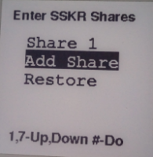 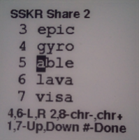

## Functions with a Seed

Once you have a seed through any of the prior flows, you can create
BIP-39 and SSKR mnemonic passphrases. In addition you can view extended public
keys, wallet addresses etc. 

### BIP-39 Generation

The BIP-39 phrase is displayed and can be backed up in a secure
offline fashion (e.g., hammering into metal).

### SSKR Generation

SSKR requires some configuration choices to determine total number of shares
and the required number of shares present to recover.

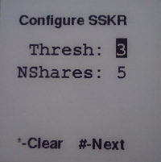 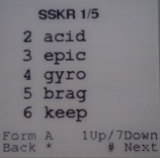

You can choose among different formats:  
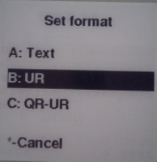
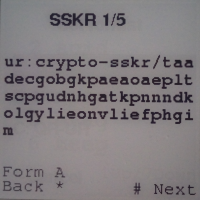 

### Displaying XPUBs

Extended public keys (XPUBs) can be shown in different formats (base58, UR, QR) with different
options (slip132, with derivation path). Derivation path can be manually set.

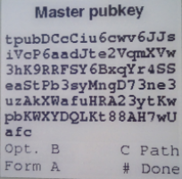
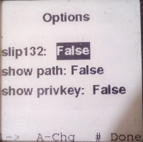
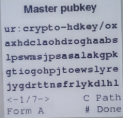

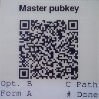
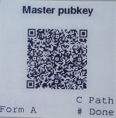
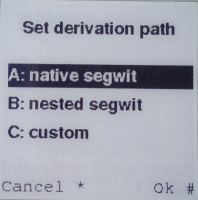

### Displaying Seed

You can choose to export seed in UR or QR-UR format.

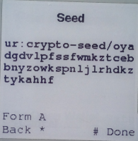
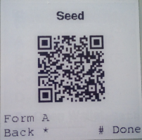

### Displaying Addresses

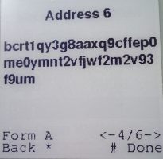 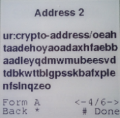
 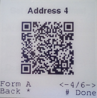
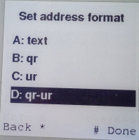

A wallet can be exported in the 4 different formats (text, QR, UR and QR-UR):

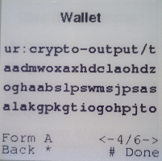 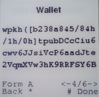
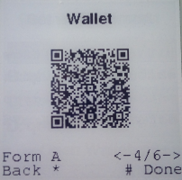 

## Common Workflows

There are several common key management workflows that *seedtool* is
useful for.

### Generate a New Wallet

By using dice to generate a BIP-39 mnemonic passphrase, you can avoid
trusting a particular hardware vendor's hardware.
[See: RNG subversion](https://en.wikipedia.org/wiki/Random_number_generator_attack#RNG_subversion)

To execute this flow with *seedtool*:
1. Generate a new master seed using 50+ die rolls.
2. Record your master BIP-39 backup in a secure manner (hammer into metal).
   This BIP-39 backup may be restored into most other wallets for common use.
3. Optionally create a SSKR sharded backup set which can serve as
   long-term cold storage.
   
### Generate a SSKR Backup Set for an Existing Wallet

If you've already got a wallet in use, and have the BIP-39 backup for
it, you can generate a SSKR backup set as well:
1. Restore your seed in *seedtool* using your BIP-39 backup.
2. Create a SSKR sharded backup.

### Recover a Master Seed from SSKR Backup Shards

If you need to recover your master seed and have enough shards from a
SSKR backup set:
1. Recover the master seed from the SSKR shards.
2. Create a BIP-39 mnemonic which may then be directly restored into
   most wallets for use.
