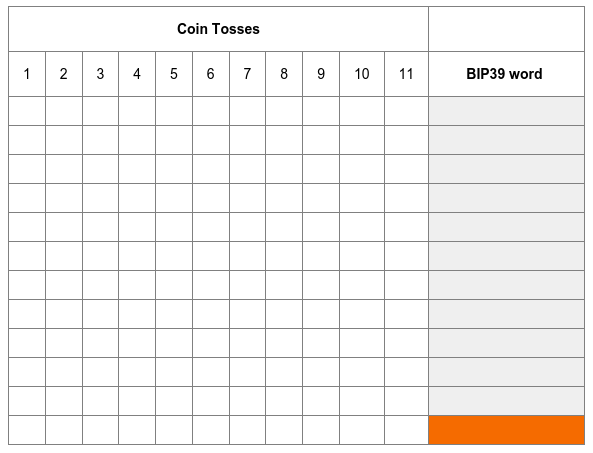
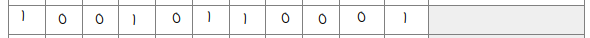
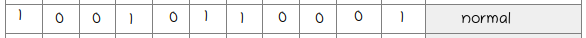
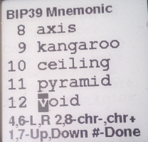
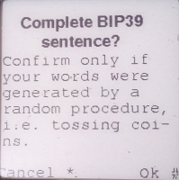
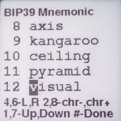
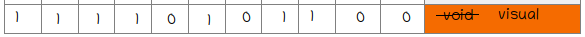
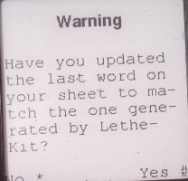

## BIP39 Sentence Completion

Option `D` (`Complete BIP39`) allows you to
complete a randomly constructed BIP39 sentence. This means that your seed, keys and wallet creation does not rely on hardware nor software but entirely on a randomized procedure conducted by yourself tossing coins. It is true however that the LetheKit completes the last word, i.e. `checksum word`, so that mnemonic sentence can be correctly parsed.

### Procedure

First print out the following table and prepare a coin.

To randomly choose a BIP39 word you have to toss a coin 11 times and fill out a row in the table. For heads you can write 1 and for tails 0.

For example if your first eleven throws are:

`heads` `tails` `tails` `heads` `tails` `heads` `heads` `tails` `tails` `tails` `heads`

then your first row should look like this:

Coin tosses in every row represent a binary number which can be converted to a BIP39 word with the help of a [lookup table](https://www.rudefox.io/custody/walkthrough/create-seed/lookup-tables.pdf)

You have to repeat the procedure 12 times to fill out the table and obtain a full mnemonic sentence of 12 words. Then input all the words into LetheKit

When `done` LetheKit will ask you if your procedure was truly randomized.

⚠️ : If the procedure is not randomized, i.e. the words are not obtained by flipping a coin, the mnemonic sentence is insecure and leads to a loss of funds.

After confirmation, LetheKit will show you the completed BIP39 sentence, i.e. the last word (i.e. `checksum word`) will be transformed to make the sentence complete, while the first eleven words will stay the same.

At this point you have to update the last word on your sheet:

When done, LetheKit will ask you whether you have updated the last word on your sheet?

By confirming with `yes`, LetheKit will generate a seed, keys and a wallet.
