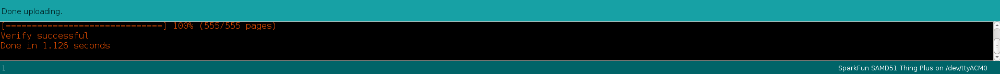

# Seedtool Installation Instructions

This guide assumes you have successfully completed
[LetheKit Installation Instructions](../../doc/installation.md)

### Open project in Arduino IDE

Launch the Arduino IDE in the `bc-lethekit/seedtool` directory:

```bash
$ arduino ./
```
Alternatively, you can launch the Arduino IDE, click `File->Open`,
locate `seedtool` directory and double click on the `seedtool.ino`.

*Note:* Make sure you have installed libraries required by LetheKit.
Navigate to your Library Manager (**Tools** > **Manage Libraries…**)
  * `Adafruit GFX Library`
  * `Keypad`
  * `QRCode`

### Build and Upload *seedtool*

Connect a LetheKit hardware device to an appropriate USB port.

To upload code to the SAMD51 module you will need to [enter the
bootloader mode](#entering-bootloader) and press the `Upload` button on the Arduino IDE. The *seedtool*
application will be built and uploaded to your device.



You should see LetheKit refreshing its screen and starting selftest.

*Note:* once you enter the bootloader mode it may take some moments for your system
to recognize your device and port again. Uploading immediately may result in error.

### Use *seedtool*

See the [Seedtool Application Instructions](../README.md) for information on using the *seedtool*.

### Entering Bootloader

#### Approach 1

Press the reset button twice in rapid succession. The blue LED
will start glowing bright.


[Source](https://learn.sparkfun.com/tutorials/samd51-thing-plus-hookup-guide/setting-up-the-arduino-ide)

#### Approach 2

It is also possible to enter bootloader mode by power cycling with the
external power switch.  Here are the steps for the external power
switch method:

1. Connect the LetheKit to a USB port on you computer. Turn the
   LetheKit on and wait a few seconds.

2. Turn off, on, off, on rapidly.

3. If the device is in bootloader mode, the blue power light will not
   be on, even though it is plugged in and the switch is left in the
   "on" position.

### For Developers

#### Install gitrevision.h

The `gitrevision.h` file is generated with git hooks and contains the
latest version information, allowing that information to be built into the application and
reported to the user.  It is not critical, but is very helpful when
reporting bugs, requesting features etc.

Enable the generation of the `gitrevision.h` file.  This only needs to
be done once, but is safe to do anytime you like.

```bash
# Must be run in the seedtool directory
./enable-gitrevision-hooks.sh
```

You may disable `gitrevision.h` generation with:
```bash
$ ./disable-gitrevision-hooks.sh
```
